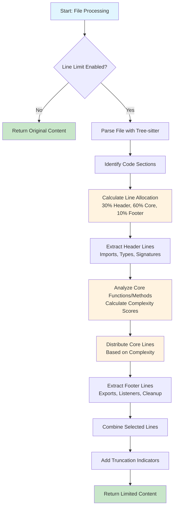
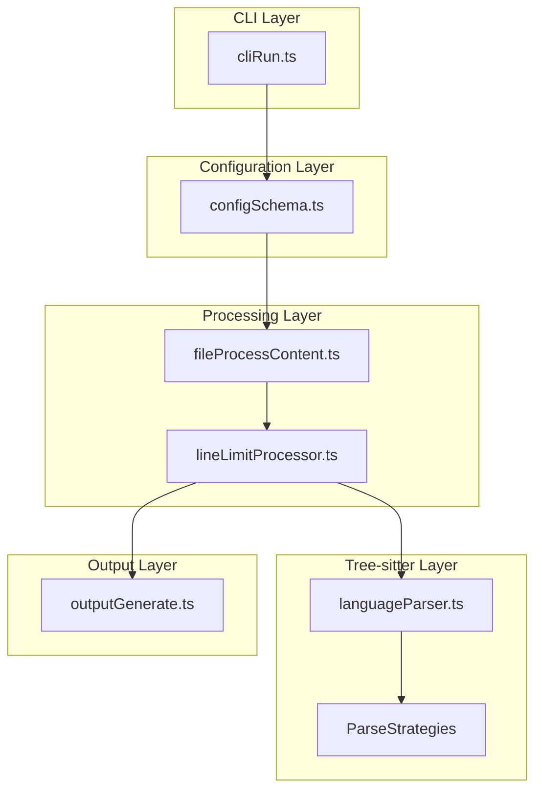

# Line Limit Algorithm Design Document

## Overview

This document outlines the comprehensive design for the intelligent line limiting algorithm for Repomix. The algorithm implements a 30/60/10 distribution strategy to preserve code structure while reducing file size to meet user-specified line limits.

## 1. Algorithm Flowchart



## 2. Core Algorithm Design

### 2.1 Line Allocation Strategy

The algorithm follows a 30/60/10 distribution based on the PRD requirements:

```typescript
interface LineAllocation {
  headerLines: number;    // 30% of total limit
  coreLines: number;      // 60% of total limit
  footerLines: number;    // 10% of total limit
}

function calculateLineAllocation(totalLimit: number): LineAllocation {
  return {
    headerLines: Math.floor(totalLimit * 0.3),
    coreLines: Math.floor(totalLimit * 0.6),
    footerLines: Math.floor(totalLimit * 0.1)
  };
}
```

### 2.2 Section Classification

The algorithm classifies code lines into three categories:

#### Header Section (30%)
- Import statements and dependencies
- Export declarations
- Type definitions and interfaces
- Class and function signatures
- Constants and global variables

#### Core Logic Section (60%)
- Function implementations
- Method bodies
- Complex logic blocks
- Error handling
- Key algorithm implementations

#### Footer Section (10%)
- Module exports
- Event listeners
- Initialization code
- Cleanup functions
- Closing statements

## 3. Data Structure Definitions

### 3.1 Core Types

```typescript
/**
 * Represents a line in the source file with metadata
 */
interface SourceLine {
  lineNumber: number;
  content: string;
  section: LineSection;
  importance: number; // 0-1 scale
  nodeType?: string; // Tree-sitter node type
}

/**
 * Classification of line sections
 */
enum LineSection {
  HEADER = 'header',
  CORE = 'core',
  FOOTER = 'footer'
}

/**
 * Function/method analysis result
 */
interface FunctionAnalysis {
  name: string;
  startLine: number;
  endLine: number;
  complexity: number;
  lineCount: number;
  isSelected: boolean;
}

/**
 * Line limiting result with metadata
 */
interface LineLimitResult {
  originalLineCount: number;
  limitedLineCount: number;
  selectedLines: SourceLine[];
  truncatedFunctions: string[];
  truncationIndicators: TruncationIndicator[];
  metadata: LineLimitMetadata;
}

/**
 * Metadata about the limiting process
 */
interface LineLimitMetadata {
  processingTimeMs: number;
  algorithm: string;
  language: string;
  allocation: LineAllocation;
  functionsAnalyzed: number;
  functionsSelected: number;
}

/**
 * Truncation indicator for showing where content was removed
 */
interface TruncationIndicator {
  position: number; // Line number where indicator is inserted
  type: 'function' | 'class' | 'block';
  description: string;
}
```

### 3.2 Language-Specific Types

```typescript
/**
 * Language-specific line limiting strategy
 */
interface LanguageStrategy {
  identifyHeaderLines(lines: string[], tree: Tree): number[];
  analyzeFunctions(lines: string[], tree: Tree): FunctionAnalysis[];
  identifyFooterLines(lines: string[], tree: Tree): number[];
  calculateComplexity(node: Node): number;
}

/**
 * Registry of language strategies
 */
interface LanguageStrategyRegistry {
  [language: string]: LanguageStrategy;
}
```

## 4. Integration Architecture

### 4.1 Integration Points

The line limiting algorithm integrates with existing Repomix components:



### 4.2 Modified Configuration Schema

```typescript
// Extension to configSchema.ts
export const repomixConfigDefaultSchema = repomixConfigDefaultSchema.extend({
  output: z.object({
    // ... existing properties
    lineLimit: z.number().positive().optional().describe('Maximum number of lines per file'),
  }),
});
```

### 4.3 Integration with fileProcessContent.ts

```typescript
// Modified processContent function
export const processContent = async (
  rawFile: RawFile, 
  config: RepomixConfigMerged
): Promise<string> => {
  // ... existing processing logic
  
  // Apply line limiting if enabled
  if (config.output.lineLimit) {
    processedContent = await applyLineLimit(
      processedContent, 
      rawFile.path, 
      config.output.lineLimit
    );
  }
  
  return processedContent;
};
```

## 5. Language-Specific Strategies

### 5.1 JavaScript/TypeScript Strategy

```typescript
class TypeScriptLineLimitStrategy implements LanguageStrategy {
  identifyHeaderLines(lines: string[], tree: Tree): number[] {
    // Identify import statements, type definitions, interfaces
    const headerLines: number[] = [];
    
    // Query for import statements
    const importQuery = new Query(tree.language, queryTypescript.import);
    const importMatches = importQuery.matches(tree.rootNode);
    
    // Query for type definitions
    const typeQuery = new Query(tree.language, queryTypescript.type_definition);
    const typeMatches = typeQuery.matches(tree.rootNode);
    
    // Query for interface definitions
    const interfaceQuery = new Query(tree.language, queryTypescript.interface);
    const interfaceMatches = interfaceQuery.matches(tree.rootNode);
    
    // Collect line numbers from all matches
    [...importMatches, ...typeMatches, ...interfaceMatches].forEach(match => {
      match.captures.forEach(capture => {
        const startLine = capture.node.startPosition.row;
        const endLine = capture.node.endPosition.row;
        for (let i = startLine; i <= endLine; i++) {
          headerLines.push(i);
        }
      });
    });
    
    return [...new Set(headerLines)].sort((a, b) => a - b);
  }
  
  analyzeFunctions(lines: string[], tree: Tree): FunctionAnalysis[] {
    const functions: FunctionAnalysis[] = [];
    
    // Query for function declarations
    const functionQuery = new Query(tree.language, queryTypescript.function);
    const functionMatches = functionQuery.matches(tree.rootNode);
    
    functionMatches.forEach(match => {
      match.captures.forEach(capture => {
        if (capture.name.includes('definition.function')) {
          const node = capture.node;
          const startLine = node.startPosition.row;
          const endLine = node.endPosition.row;
          
          // Extract function name
          const name = this.extractFunctionName(node, lines);
          
          // Calculate complexity
          const complexity = this.calculateComplexity(node);
          
          functions.push({
            name,
            startLine,
            endLine,
            complexity,
            lineCount: endLine - startLine + 1,
            isSelected: false
          });
        }
      });
    });
    
    return functions;
  }
  
  identifyFooterLines(lines: string[], tree: Tree): number[] {
    // Identify export statements, event listeners, module initialization
    const footerLines: number[] = [];
    
    // Query for export statements
    const exportQuery = new Query(tree.language, queryTypescript.export);
    const exportMatches = exportQuery.matches(tree.rootNode);
    
    // Query for event listeners
    const eventListenerQuery = new Query(tree.language, 
      '(call_expression function: (identifier) @function (#match? @function "addEventListener"))');
    
    // Collect line numbers
    [...exportMatches].forEach(match => {
      match.captures.forEach(capture => {
        const startLine = capture.node.startPosition.row;
        const endLine = capture.node.endPosition.row;
        for (let i = startLine; i <= endLine; i++) {
          footerLines.push(i);
        }
      });
    });
    
    return [...new Set(footerLines)].sort((a, b) => a - b);
  }
  
  calculateComplexity(node: Node): number {
    // Calculate cyclomatic complexity based on control structures
    let complexity = 1; // Base complexity
    
    // Query for control structures
    const controlStructures = [
      'if_statement',
      'while_statement',
      'for_statement',
      'switch_statement',
      'try_statement',
      'catch_clause'
    ];
    
    controlStructures.forEach(structure => {
      const query = new Query(node.tree.language, `(${structure}) @control`);
      const matches = query.matches(node);
      complexity += matches.length;
    });
    
    // Normalize to 0-1 scale
    return Math.min(complexity / 10, 1);
  }
  
  private extractFunctionName(node: Node, lines: string[]): string {
    // Extract function name from node
    const functionNameNode = node.childForFieldName('name');
    if (functionNameNode) {
      return lines[functionNameNode.startPosition.row]
        .substring(functionNameNode.startPosition.column, functionNameNode.endPosition.column)
        .trim();
    }
    return 'anonymous';
  }
}
```

### 5.2 Python Strategy

```typescript
class PythonLineLimitStrategy implements LanguageStrategy {
  identifyHeaderLines(lines: string[], tree: Tree): number[] {
    const headerLines: number[] = [];
    
    // Query for import statements
    const importQuery = new Query(tree.language, queryPython.import);
    const importMatches = importQuery.matches(tree.rootNode);
    
    // Query for class definitions
    const classQuery = new Query(tree.language, queryPython.class);
    const classMatches = classQuery.matches(tree.rootNode);
    
    // Query for function definitions (signatures only)
    const functionQuery = new Query(tree.language, queryPython.function);
    const functionMatches = functionQuery.matches(tree.rootNode);
    
    // Collect header lines
    [...importMatches, ...classMatches, ...functionMatches].forEach(match => {
      match.captures.forEach(capture => {
        const node = capture.node;
        if (node.type === 'import_statement' || 
            node.type === 'class_definition' ||
            (node.type === 'function_definition' && this.isSignatureOnly(node, lines))) {
          const startLine = node.startPosition.row;
          const endLine = node.endPosition.row;
          for (let i = startLine; i <= endLine; i++) {
            headerLines.push(i);
          }
        }
      });
    });
    
    return [...new Set(headerLines)].sort((a, b) => a - b);
  }
  
  analyzeFunctions(lines: string[], tree: Tree): FunctionAnalysis[] {
    // Similar to TypeScript but adapted for Python syntax
    const functions: FunctionAnalysis[] = [];
    
    const functionQuery = new Query(tree.language, queryPython.function);
    const functionMatches = functionQuery.matches(tree.rootNode);
    
    functionMatches.forEach(match => {
      match.captures.forEach(capture => {
        if (capture.name.includes('definition.function')) {
          const node = capture.node;
          const startLine = node.startPosition.row;
          const endLine = node.endPosition.row;
          
          // Extract function name
          const name = this.extractPythonFunctionName(node, lines);
          
          // Calculate complexity
          const complexity = this.calculatePythonComplexity(node);
          
          functions.push({
            name,
            startLine,
            endLine,
            complexity,
            lineCount: endLine - startLine + 1,
            isSelected: false
          });
        }
      });
    });
    
    return functions;
  }
  
  // ... other methods adapted for Python
}
```

### 5.3 Strategy Registry

```typescript
// Language strategy factory
export class LineLimitStrategyFactory {
  private static strategies: LanguageStrategyRegistry = {
    typescript: new TypeScriptLineLimitStrategy(),
    javascript: new TypeScriptLineLimitStrategy(), // Reuse TypeScript strategy
    python: new PythonLineLimitStrategy(),
    java: new JavaLineLimitStrategy(),
    go: new GoLineLimitStrategy(),
    c: new CLineLimitStrategy(),
    cpp: new CppLineLimitStrategy(),
    c_sharp: new CSharpLineLimitStrategy(),
    rust: new RustLineLimitStrategy(),
    php: new PhpLineLimitStrategy(),
    ruby: new RubyLineLimitStrategy(),
    swift: new SwiftLineLimitStrategy(),
    dart: new DartLineLimitStrategy(),
  };
  
  static getStrategy(language: string): LanguageStrategy | undefined {
    return this.strategies[language];
  }
  
  static registerStrategy(language: string, strategy: LanguageStrategy): void {
    this.strategies[language] = strategy;
  }
}
```

## 6. Performance Optimizations

### 6.1 Streaming Processing

```typescript
/**
 * Streaming line processor for large files
 */
class StreamingLineProcessor {
  private readonly chunkSize = 1000; // Process 1000 lines at a time
  
  async processLargeFile(
    content: string, 
    lineLimit: number, 
    strategy: LanguageStrategy
  ): Promise<LineLimitResult> {
    const lines = content.split('\n');
    
    // Process in chunks to avoid memory issues
    const chunks = this.createChunks(lines, this.chunkSize);
    const selectedLines: SourceLine[] = [];
    
    for (const chunk of chunks) {
      const chunkResult = await this.processChunk(chunk, strategy);
      selectedLines.push(...chunkResult);
      
      // Early termination if we've reached the limit
      if (selectedLines.length >= lineLimit) {
        break;
      }
    }
    
    return this.buildResult(selectedLines, lineLimit);
  }
  
  private createChunks(lines: string[], chunkSize: number): string[][] {
    const chunks: string[][] = [];
    for (let i = 0; i < lines.length; i += chunkSize) {
      chunks.push(lines.slice(i, i + chunkSize));
    }
    return chunks;
  }
  
  private async processChunk(chunk: string[], strategy: LanguageStrategy): Promise<SourceLine[]> {
    // Process chunk with language-specific strategy
    // Implementation depends on strategy capabilities
    return [];
  }
}
```

### 6.2 Caching Strategy

```typescript
/**
 * Cache for parsed AST results
 */
class ASTCache {
  private cache = new Map<string, { tree: Tree; timestamp: number }>();
  private readonly maxAge = 5 * 60 * 1000; // 5 minutes
  
  get(filePath: string, content: string): Tree | null {
    const key = this.generateKey(filePath, content);
    const cached = this.cache.get(key);
    
    if (cached && Date.now() - cached.timestamp < this.maxAge) {
      return cached.tree;
    }
    
    return null;
  }
  
  set(filePath: string, content: string, tree: Tree): void {
    const key = this.generateKey(filePath, content);
    this.cache.set(key, { tree, timestamp: Date.now() });
    
    // Cleanup old entries
    this.cleanup();
  }
  
  private generateKey(filePath: string, content: string): string {
    return `${filePath}:${this.hashContent(content)}`;
  }
  
  private hashContent(content: string): string {
    // Simple hash function for content
    let hash = 0;
    for (let i = 0; i < content.length; i++) {
      const char = content.charCodeAt(i);
      hash = ((hash << 5) - hash) + char;
      hash = hash & hash; // Convert to 32-bit integer
    }
    return hash.toString();
  }
  
  private cleanup(): void {
    const now = Date.now();
    for (const [key, value] of this.cache.entries()) {
      if (now - value.timestamp > this.maxAge) {
        this.cache.delete(key);
      }
    }
  }
}
```

### 6.3 Parallel Processing

```typescript
/**
 * Parallel line processing for multiple files
 */
class ParallelLineProcessor {
  private readonly maxConcurrency = 4;
  
  async processFiles(
    files: ProcessedFile[], 
    lineLimit: number
  ): Promise<ProcessedFile[]> {
    const semaphore = new Semaphore(this.maxConcurrency);
    
    const promises = files.map(async (file) => {
      await semaphore.acquire();
      try {
        return await this.processFile(file, lineLimit);
      } finally {
        semaphore.release();
      }
    });
    
    return Promise.all(promises);
  }
  
  private async processFile(file: ProcessedFile, lineLimit: number): Promise<ProcessedFile> {
    const strategy = LineLimitStrategyFactory.getStrategy(this.detectLanguage(file.path));
    if (!strategy) {
      return file; // No processing for unsupported languages
    }
    
    const result = await this.applyLineLimit(file.content, lineLimit, strategy);
    return {
      ...file,
      content: result.selectedLines.map(line => line.content).join('\n')
    };
  }
  
  private detectLanguage(filePath: string): string {
    // Use existing language detection logic
    const ext = path.extname(filePath).toLowerCase().slice(1);
    const langMap = {
      'ts': 'typescript',
      'js': 'javascript',
      'py': 'python',
      'java': 'java',
      'go': 'go',
      'c': 'c',
      'cpp': 'cpp',
      'cs': 'c_sharp',
      'rs': 'rust',
      'php': 'php',
      'rb': 'ruby',
      'swift': 'swift',
      'dart': 'dart'
    };
    
    return langMap[ext] || 'unknown';
  }
}
```

## 7. Error Handling

### 7.1 Error Types

```typescript
/**
 * Line limiting specific errors
 */
export class LineLimitError extends RepomixError {
  constructor(
    message: string,
    public readonly filePath: string,
    public readonly lineLimit: number,
    cause?: Error
  ) {
    super(message, cause);
    this.name = 'LineLimitError';
  }
}

/**
 * Error when line limit is too small for meaningful content
 */
export class LineLimitTooSmallError extends LineLimitError {
  constructor(filePath: string, lineLimit: number, minimumRequired: number) {
    super(
      `Line limit ${lineLimit} is too small for file ${filePath}. Minimum required: ${minimumRequired}`,
      filePath,
      lineLimit
    );
    this.name = 'LineLimitTooSmallError';
  }
}

/**
 * Error when parsing fails for line limiting
 */
export class LineLimitParseError extends LineLimitError {
  constructor(filePath: string, lineLimit: number, parseError: Error) {
    super(
      `Failed to parse file ${filePath} for line limiting: ${parseError.message}`,
      filePath,
      lineLimit,
      parseError
    );
    this.name = 'LineLimitParseError';
  }
}
```

### 7.2 Error Handling Strategy

```typescript
/**
 * Robust error handling for line limiting
 */
class LineLimitErrorHandler {
  async safeApplyLineLimit(
    content: string,
    filePath: string,
    lineLimit: number
  ): Promise<LineLimitResult> {
    try {
      return await this.applyLineLimit(content, filePath, lineLimit);
    } catch (error) {
      return this.handleError(error, content, filePath, lineLimit);
    }
  }
  
  private handleError(
    error: unknown,
    content: string,
    filePath: string,
    lineLimit: number
  ): LineLimitResult {
    if (error instanceof LineLimitError) {
      logger.warn(`Line limiting error for ${filePath}: ${error.message}`);
      return this.createFallbackResult(content, filePath, lineLimit, error.message);
    }
    
    if (error instanceof Error) {
      logger.error(`Unexpected error during line limiting for ${filePath}: ${error.message}`);
      return this.createFallbackResult(content, filePath, lineLimit, 'Unexpected error');
    }
    
    logger.error(`Unknown error during line limiting for ${filePath}`);
    return this.createFallbackResult(content, filePath, lineLimit, 'Unknown error');
  }
  
  private createFallbackResult(
    content: string,
    filePath: string,
    lineLimit: number,
    errorMessage: string
  ): LineLimitResult {
    const lines = content.split('\n');
    const fallbackLines = lines.slice(0, Math.min(lineLimit, lines.length));
    
    return {
      originalLineCount: lines.length,
      limitedLineCount: fallbackLines.length,
      selectedLines: fallbackLines.map((line, index) => ({
        lineNumber: index + 1,
        content: line,
        section: LineSection.CORE,
        importance: 0.5
      })),
      truncatedFunctions: [],
      truncationIndicators: [{
        position: fallbackLines.length,
        type: 'block',
        description: `Line limiting failed: ${errorMessage}`
      }],
      metadata: {
        processingTimeMs: 0,
        algorithm: 'fallback',
        language: 'unknown',
        allocation: calculateLineAllocation(lineLimit),
        functionsAnalyzed: 0,
        functionsSelected: 0
      }
    };
  }
}
```

## 8. Testing Strategy

### 8.1 Unit Testing

```typescript
/**
 * Test suite for line limiting algorithm
 */
describe('LineLimitAlgorithm', () => {
  describe('Line Allocation', () => {
    test('should allocate lines according to 30/60/10 distribution', () => {
      const allocation = calculateLineAllocation(100);
      expect(allocation.headerLines).toBe(30);
      expect(allocation.coreLines).toBe(60);
      expect(allocation.footerLines).toBe(10);
    });
    
    test('should handle rounding correctly', () => {
      const allocation = calculateLineAllocation(33);
      expect(allocation.headerLines).toBe(9);   // Math.floor(33 * 0.3)
      expect(allocation.coreLines).toBe(19);    // Math.floor(33 * 0.6)
      expect(allocation.footerLines).toBe(3);   // Math.floor(33 * 0.1)
    });
  });
  
  describe('TypeScript Strategy', () => {
    test('should identify header lines correctly', async () => {
      const content = `
import { Component } from '@angular/core';
export interface User {
  id: number;
  name: string;
}
class UserService {
  constructor() {}
  getUser(id: number) {
    return { id, name: 'John' };
  }
}
export default UserService;
      `;
      
      const tree = await parseFile(content, 'test.ts', config);
      const strategy = new TypeScriptLineLimitStrategy();
      const headerLines = strategy.identifyHeaderLines(content.split('\n'), tree);
      
      // Should include import, interface, and class signature
      expect(headerLines).toContain(1); // import
      expect(headerLines).toContain(3); // interface
      expect(headerLines).toContain(7); // class
    });
    
    test('should analyze functions correctly', async () => {
      const content = `
function simpleFunction() {
  return 'simple';
}

function complexFunction(param: string) {
  if (param) {
    for (let i = 0; i < 10; i++) {
      if (param[i] === 'a') {
        return 'found';
      }
    }
  }
  return 'not found';
}
      `;
      
      const tree = await parseFile(content, 'test.ts', config);
      const strategy = new TypeScriptLineLimitStrategy();
      const functions = strategy.analyzeFunctions(content.split('\n'), tree);
      
      expect(functions).toHaveLength(2);
      const complexFn = functions.find(f => f.name === 'complexFunction');
      expect(complexFn?.complexity).toBeGreaterThan(functions.find(f => f.name === 'simpleFunction')?.complexity || 0);
    });
  });
  
  describe('Error Handling', () => {
    test('should handle line limit too small', () => {
      const content = 'import x; export default x;';
      expect(() => applyLineLimit(content, 'test.js', 1)).toThrow(LineLimitTooSmallError);
    });
    
    test('should handle parse errors gracefully', async () => {
      const content = 'invalid javascript syntax {{{';
      const result = await safeApplyLineLimit(content, 'test.js', 10);
      expect(result.selectedLines).toHaveLength(Math.min(10, content.split('\n').length));
      expect(result.truncationIndicators).toHaveLength(1);
    });
  });
});
```

### 8.2 Integration Testing

```typescript
/**
 * Integration tests for line limiting with Repomix
 */
describe('LineLimit Integration', () => {
  test('should integrate with file processing pipeline', async () => {
    const config = {
      ...defaultConfig,
      output: {
        ...defaultConfig.output,
        lineLimit: 50
      }
    };
    
    const rawFile: RawFile = {
      path: 'test.ts',
      content: generateLargeTypeScriptFile(1000) // 1000 lines
    };
    
    const processedContent = await processContent(rawFile, config);
    const lines = processedContent.split('\n');
    
    expect(lines.length).toBeLessThanOrEqual(50);
    expect(processedContent).toContain('import'); // Should preserve imports
    expect(processedContent).toContain('export'); // Should preserve exports
  });
  
  test('should work with all output formats', async () => {
    const config = {
      ...defaultConfig,
      output: {
        ...defaultConfig.output,
        lineLimit: 20,
        style: 'markdown'
      }
    };
    
    const files = [
      { path: 'test1.js', content: generateLargeJavaScriptFile(100) },
      { path: 'test2.py', content: generateLargePythonFile(100) }
    ];
    
    const output = await generateOutput(['.'], config, files, files.map(f => f.path));
    
    expect(output).toContain('```'); // Markdown code blocks
    expect(output.split('\n').length).toBeLessThan(200); // Reasonable limit
  });
});
```

### 8.3 Performance Testing

```typescript
/**
 * Performance tests for line limiting
 */
describe('LineLimit Performance', () => {
  test('should handle large files efficiently', async () => {
    const largeFile = generateLargeTypeScriptFile(10000); // 10k lines
    const startTime = Date.now();
    
    const result = await applyLineLimit(largeFile, 'large.ts', 100);
    const endTime = Date.now();
    
    expect(endTime - startTime).toBeLessThan(1000); // Should complete in < 1s
    expect(result.selectedLines.length).toBeLessThanOrEqual(100);
  });
  
  test('should process multiple files in parallel', async () => {
    const files = Array.from({ length: 100 }, (_, i) => ({
      path: `file${i}.js`,
      content: generateLargeJavaScriptFile(500)
    }));
    
    const startTime = Date.now();
    const processor = new ParallelLineProcessor();
    const results = await processor.processFiles(files, 50);
    const endTime = Date.now();
    
    expect(results).toHaveLength(100);
    expect(endTime - startTime).toBeLessThan(5000); // Should complete in < 5s
  });
});
```

## 9. Implementation Approach

### 9.1 Phase 1: Core Implementation

1. **Create line limiting processor module** (`src/core/file/lineLimitProcessor.ts`)
2. **Implement basic algorithm** with 30/60/10 distribution
3. **Add TypeScript/JavaScript strategy** as proof of concept
4. **Integrate with file processing pipeline**
5. **Add basic unit tests**

### 9.2 Phase 2: Language Expansion

1. **Implement strategies for all 12 supported languages**
2. **Add complexity calculation algorithms**
3. **Optimize performance with caching**
4. **Add comprehensive error handling**
5. **Expand test coverage**

### 9.3 Phase 3: Polish and Optimization

1. **Add streaming processing for large files**
2. **Implement parallel processing**
3. **Add performance monitoring and metrics**
4. **Optimize memory usage**
5. **Add integration tests**

## 10. Monitoring and Metrics

### 10.1 Performance Metrics

```typescript
/**
 * Performance monitoring for line limiting
 */
interface LineLimitMetrics {
  processingTimeMs: number;
  originalLineCount: number;
  limitedLineCount: number;
  compressionRatio: number;
  memoryUsageMB: number;
  cacheHitRate: number;
  errorCount: number;
}

class LineLimitMetricsCollector {
  private metrics: LineLimitMetrics[] = [];
  
  recordMetrics(metrics: LineLimitMetrics): void {
    this.metrics.push(metrics);
    
    // Log performance warnings
    if (metrics.processingTimeMs > 1000) {
      logger.warn(`Slow line limiting detected: ${metrics.processingTimeMs}ms`);
    }
    
    if (metrics.compressionRatio < 0.1) {
      logger.warn(`Low compression ratio: ${metrics.compressionRatio}`);
    }
  }
  
  getAverageMetrics(): LineLimitMetrics {
    if (this.metrics.length === 0) {
      throw new Error('No metrics available');
    }
    
    const sum = this.metrics.reduce((acc, metric) => ({
      processingTimeMs: acc.processingTimeMs + metric.processingTimeMs,
      originalLineCount: acc.originalLineCount + metric.originalLineCount,
      limitedLineCount: acc.limitedLineCount + metric.limitedLineCount,
      compressionRatio: acc.compressionRatio + metric.compressionRatio,
      memoryUsageMB: acc.memoryUsageMB + metric.memoryUsageMB,
      cacheHitRate: acc.cacheHitRate + metric.cacheHitRate,
      errorCount: acc.errorCount + metric.errorCount
    }));
    
    const count = this.metrics.length;
    return {
      processingTimeMs: sum.processingTimeMs / count,
      originalLineCount: sum.originalLineCount / count,
      limitedLineCount: sum.limitedLineCount / count,
      compressionRatio: sum.compressionRatio / count,
      memoryUsageMB: sum.memoryUsageMB / count,
      cacheHitRate: sum.cacheHitRate / count,
      errorCount: sum.errorCount / count
    };
  }
}
```

## 11. Conclusion

This design provides a comprehensive approach to implementing intelligent line limiting in Repomix. The algorithm:

1. **Preserves code structure** through intelligent section analysis
2. **Maintains readability** with the 30/60/10 distribution strategy
3. **Supports all 12 languages** through extensible strategy pattern
4. **Handles large files efficiently** with streaming and parallel processing
5. **Provides robust error handling** with fallback mechanisms
6. **Integrates seamlessly** with existing Repomix architecture

The implementation will significantly enhance Repomix's usability for users working with large codebases while maintaining the tool's performance and reliability standards.