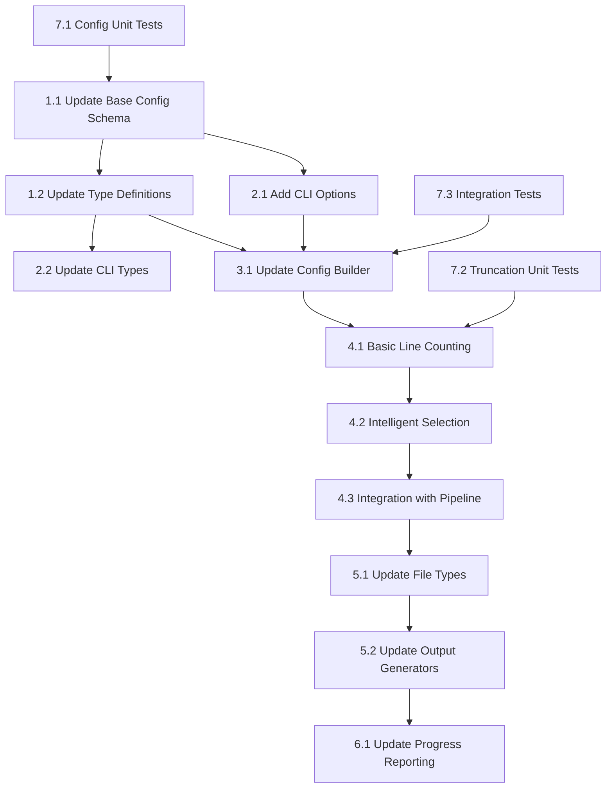

# Task List: Core Implementation

## Overview

This document provides a detailed breakdown of implementation tasks for the line limit feature in Repomix. The tasks are organized by component, priority, and dependencies to ensure a systematic approach to development.

## Task Prioritization

### Critical Path (Must be completed first)
1. **Configuration Schema Updates** - Foundation for all other components
2. **CLI Option Registration** - User interface for the feature
3. **Type Definitions** - Type safety across the codebase
4. **Basic Truncation Logic** - Core functionality implementation

### Parallel Development (Can be developed simultaneously)
1. **Advanced Truncation Algorithm** - Enhanced line selection
2. **Output Format Integration** - Format-specific handling
3. **Progress Reporting** - User feedback mechanisms
4. **Testing Infrastructure** - Test suite development

## Detailed Task Breakdown

### 1. Configuration Schema Updates

#### 1.1 Update Base Configuration Schema
**File**: `src/config/configSchema.ts`

**Task Details**:
- Add `lineLimit` property to `repomixConfigBaseSchema`
- Add `lineLimit` property to `repomixConfigDefaultSchema`
- Ensure proper validation and default values

**Implementation**:
```typescript
// Add to repomixConfigBaseSchema (around line 54)
output: z
  .object({
    // ... existing properties
    lineLimit: z.number().positive().optional(), // Add this line
  })
  .optional(),

// Add to repomixConfigDefaultSchema (around line 110)
output: z.object({
  // ... existing properties
  lineLimit: z.number().positive().nullable().default(null), // Add this line
}),
```

**Acceptance Criteria**:
- [ ] Schema validates positive integers for lineLimit
- [ ] Default value is null (no limit) for backward compatibility
- [ ] Schema compilation succeeds without errors
- [ ] Type definitions are automatically generated

**Estimated Time**: 2 hours

#### 1.2 Update Type Definitions
**File**: `src/config/configSchema.ts`

**Task Details**:
- Ensure `RepomixConfigDefault`, `RepomixConfigFile`, and `RepomixConfigMerged` types include the new `lineLimit` property

**Acceptance Criteria**:
- [ ] All config types include lineLimit property
- [ ] TypeScript compilation succeeds
- [ ] Type checking works correctly in IDE

**Estimated Time**: 1 hour

### 2. CLI Option Registration

#### 2.1 Add CLI Options
**File**: `src/cli/cliRun.ts`

**Task Details**:
- Add `--line` and `--line-limit` options to the CLI parser
- Implement input validation for positive integers
- Add help text and examples

**Implementation**:
```typescript
// Add around line 139 (after --include-logs-count)
.option(
  '--line <number>',
  'Maximum number of lines per file (e.g., --line 100)',
  (v: string) => {
    if (!/^\d+$/.test(v)) {
      throw new RepomixError(`Invalid number for --line: '${v}'. Must be a positive integer.`);
    }
    return Number(v);
  },
)
.option(
  '--line-limit <number>',
  'Alias for --line option',
  (v: string) => {
    if (!/^\d+$/.test(v)) {
      throw new RepomixError(`Invalid number for --line-limit: '${v}'. Must be a positive integer.`);
    }
    return Number(v);
  },
)
```

**Acceptance Criteria**:
- [ ] CLI accepts both `--line` and `--line-limit` options
- [ ] Validation rejects non-positive integers
- [ ] Help text is descriptive and includes examples
- [ ] Error messages are clear and actionable

**Estimated Time**: 3 hours

#### 2.2 Update CLI Types
**File**: `src/cli/types.ts`

**Task Details**:
- Add `line` and `lineLimit` properties to `CliOptions` interface

**Implementation**:
```typescript
export interface CliOptions extends OptionValues {
  // ... existing properties
  line?: number;
  lineLimit?: number;
  // ... existing properties
}
```

**Acceptance Criteria**:
- [ ] TypeScript interface includes new properties
- [ ] Type checking works correctly
- [ ] No compilation errors

**Estimated Time**: 1 hour

### 3. Configuration Parsing

#### 3.1 Update Default Action Configuration Builder
**File**: `src/cli/actions/defaultAction.ts`

**Task Details**:
- Add line limit handling to `buildCliConfig` function
- Ensure CLI options override config file settings
- Handle both `--line` and `--line-limit` options

**Implementation**:
```typescript
// Add around line 284 (after tokenCountTree handling)
if (options.line !== undefined || options.lineLimit !== undefined) {
  cliConfig.output = {
    ...cliConfig.output,
    lineLimit: options.line ?? options.lineLimit,
  };
}
```

**Acceptance Criteria**:
- [ ] CLI options properly populate config object
- [ ] `--line` takes precedence over `--line-limit` if both provided
- [ ] CLI overrides config file settings
- [ ] Validation errors are properly propagated

**Estimated Time**: 2 hours

### 4. Core Truncation Logic

#### 4.1 Basic Line Counting Function
**File**: `src/core/file/fileProcessContent.ts`

**Task Details**:
- Create a function to count lines in content
- Handle different line ending styles (\n, \r\n, \r)
- Create a function to truncate content to specified line count

**Implementation**:
```typescript
/**
 * Count lines in content, handling different line endings
 */
const countLines = (content: string): number => {
  return content.split(/\r?\n/).length;
};

/**
 * Truncate content to specified number of lines
 */
const truncateToLines = (content: string, maxLines: number): string => {
  const lines = content.split(/\r?\n/);
  return lines.slice(0, maxLines).join('\n');
};
```

**Acceptance Criteria**:
- [ ] Line counting works with different line endings
- [ ] Truncation preserves original line endings
- [ ] Empty content is handled correctly
- [ ] Content shorter than limit is returned unchanged

**Estimated Time**: 3 hours

#### 4.2 Intelligent Line Selection Algorithm
**File**: `src/core/file/fileProcessContent.ts`

**Task Details**:
- Implement the 30/60/10 distribution algorithm
- Preserve imports, exports, and function signatures
- Distribute remaining lines across major code blocks
- Add truncation indicators

**Implementation**:
```typescript
interface LineSelectionResult {
  content: string;
  wasTruncated: boolean;
  originalLineCount: number;
  truncatedLineCount: number;
}

/**
 * Intelligently select lines to preserve code structure
 */
const selectLinesIntelligently = (
  content: string, 
  maxLines: number,
  filePath: string
): LineSelectionResult => {
  const lines = content.split(/\r?\n/);
  const originalLineCount = lines.length;
  
  // If content is already within limit, return as-is
  if (originalLineCount <= maxLines) {
    return {
      content,
      wasTruncated: false,
      originalLineCount,
      truncatedLineCount: originalLineCount,
    };
  }
  
  // Calculate line allocations (30/60/10 distribution)
  const headerLines = Math.floor(maxLines * 0.3);
  const coreLines = Math.floor(maxLines * 0.6);
  const footerLines = Math.floor(maxLines * 0.1);
  
  // TODO: Implement language-specific parsing logic
  // For now, implement basic truncation
  const selectedLines = lines.slice(0, maxLines);
  
  return {
    content: selectedLines.join('\n'),
    wasTruncated: true,
    originalLineCount,
    truncatedLineCount: selectedLines.length,
  };
};
```

**Acceptance Criteria**:
- [ ] Algorithm preserves file structure
- [ ] Imports and exports are prioritized
- [ ] Function signatures are included when possible
- [ ] Truncation indicators are added
- [ ] Performance is acceptable for large files

**Estimated Time**: 8 hours

#### 4.3 Integration with File Processing Pipeline
**File**: `src/core/file/fileProcessContent.ts`

**Task Details**:
- Integrate line limiting into `processContent` function
- Add line limiting after other transformations
- Preserve truncation metadata for reporting

**Implementation**:
```typescript
// Modify processContent function (around line 60)
if (config.output.lineLimit) {
  const selectionResult = selectLinesIntelligently(
    processedContent, 
    config.output.lineLimit, 
    rawFile.path
  );
  processedContent = selectionResult.content;
  
  // Store truncation metadata for reporting
  // TODO: Add metadata storage mechanism
}
```

**Acceptance Criteria**:
- [ ] Line limiting is applied after other transformations
- [ ] Configuration is properly respected
- [ ] Truncation metadata is preserved
- [ ] Error handling is robust

**Estimated Time**: 3 hours

### 5. Output Format Integration

#### 5.1 Update File Types
**File**: `src/core/file/fileTypes.ts`

**Task Details**:
- Add truncation metadata to `ProcessedFile` interface
- Ensure backward compatibility

**Implementation**:
```typescript
export interface ProcessedFile {
  path: string;
  content: string;
  truncation?: {
    wasTruncated: boolean;
    originalLineCount: number;
    truncatedLineCount: number;
  };
}
```

**Acceptance Criteria**:
- [ ] Interface includes truncation metadata
- [ ] TypeScript compilation succeeds
- [ ] Backward compatibility is maintained

**Estimated Time**: 1 hour

#### 5.2 Update Output Generators
**File**: `src/core/output/outputGenerate.ts`

**Task Details**:
- Add truncation indicators to XML output
- Add truncation indicators to Markdown output
- Add truncation indicators to JSON output
- Update templates to handle truncation metadata

**Implementation**:
```typescript
// Update XML template (around line 82)
file: renderContext.processedFiles.map((file) => ({
  '#text': file.content,
  '@_path': file.path,
  ...(file.truncation?.wasTruncated && {
    '@_truncated': true,
    '@_originalLines': file.truncation.originalLineCount,
    '@_truncatedLines': file.truncation.truncatedLineCount,
  }),
})),

// Update JSON template (around line 134)
files: renderContext.processedFiles.reduce(
  (acc, file) => {
    acc[file.path] = {
      content: file.content,
      ...(file.truncation?.wasTruncated && {
        truncated: true,
        originalLines: file.truncation.originalLineCount,
        truncatedLines: file.truncation.truncatedLineCount,
      }),
    };
    return acc;
  },
  {} as Record<string, any>,
),
```

**Acceptance Criteria**:
- [ ] All output formats show truncation indicators
- [ ] Truncation metadata is properly formatted
- [ ] Templates render correctly with truncation data
- [ ] Backward compatibility is maintained

**Estimated Time**: 4 hours

### 6. Progress Reporting

#### 6.1 Update Progress Indicators
**File**: `src/cli/cliReport.ts`

**Task Details**:
- Add truncation status to progress reporting
- Include truncation statistics in final report
- Update file tree visualization

**Implementation**:
```typescript
// Add truncation statistics to report
const reportTruncationStats = (packResult: PackResult): void => {
  const truncatedFiles = packResult.processedFiles.filter(
    file => file.truncation?.wasTruncated
  );
  
  if (truncatedFiles.length > 0) {
    logger.info(`\n📊 Truncation Summary:`);
    logger.info(`  Files truncated: ${truncatedFiles.length}/${packResult.totalFiles}`);
    
    const totalOriginalLines = truncatedFiles.reduce(
      (sum, file) => sum + (file.truncation?.originalLineCount || 0), 0
    );
    const totalTruncatedLines = truncatedFiles.reduce(
      (sum, file) => sum + (file.truncation?.truncatedLineCount || 0), 0
    );
    
    logger.info(`  Total lines reduced: ${totalOriginalLines - totalTruncatedLines}`);
    logger.info(`  Line reduction ratio: ${((totalOriginalLines - totalTruncatedLines) / totalOriginalLines * 100).toFixed(1)}%`);
  }
};
```

**Acceptance Criteria**:
- [ ] Progress shows truncation status
- [ ] Final report includes truncation statistics
- [ ] File tree indicates truncated files
- [ ] Verbose mode shows detailed truncation info

**Estimated Time**: 3 hours

### 7. Testing Implementation

#### 7.1 Unit Tests for Configuration
**File**: `tests/config/configSchema.test.ts`

**Task Details**:
- Test line limit schema validation
- Test default value handling
- Test type safety

**Test Cases**:
```typescript
describe('Line Limit Configuration', () => {
  it('should validate positive integers', () => {
    expect(() => repomixConfigDefaultSchema.parse({
      output: { lineLimit: 100 }
    })).not.toThrow();
  });
  
  it('should reject non-positive integers', () => {
    expect(() => repomixConfigDefaultSchema.parse({
      output: { lineLimit: 0 }
    })).toThrow();
  });
  
  it('should accept null as default', () => {
    const config = repomixConfigDefaultSchema.parse({});
    expect(config.output.lineLimit).toBe(null);
  });
});
```

**Acceptance Criteria**:
- [ ] All test cases pass
- [ ] Edge cases are covered
- [ ] Test coverage is >90%

**Estimated Time**: 4 hours

#### 7.2 Unit Tests for Truncation Logic
**File**: `tests/core/file/fileProcessContent.test.ts`

**Task Details**:
- Test line counting function
- Test basic truncation
- Test intelligent selection algorithm
- Test edge cases

**Test Cases**:
```typescript
describe('Line Limiting', () => {
  it('should count lines correctly', () => {
    const content = 'line1\nline2\r\nline3';
    expect(countLines(content)).toBe(3);
  });
  
  it('should truncate to specified line count', () => {
    const content = 'line1\nline2\nline3\nline4';
    const result = truncateToLines(content, 2);
    expect(result).toBe('line1\nline2');
  });
  
  it('should handle content shorter than limit', () => {
    const content = 'line1\nline2';
    const result = truncateToLines(content, 5);
    expect(result).toBe(content);
  });
});
```

**Acceptance Criteria**:
- [ ] All truncation scenarios are tested
- [ ] Performance tests pass
- [ ] Edge cases are handled

**Estimated Time**: 6 hours

#### 7.3 Integration Tests
**File**: `tests/integration-tests/lineLimit.test.ts`

**Task Details**:
- Test end-to-end CLI workflows
- Test configuration file integration
- Test output format compatibility

**Test Cases**:
```typescript
describe('Line Limit Integration', () => {
  it('should apply line limit from CLI option', async () => {
    const result = await runCli(['--line', '10', './test-files']);
    expect(result.packResult.processedFiles[0].truncation?.wasTruncated).toBe(true);
  });
  
  it('should apply line limit from config file', async () => {
    // Test with config file containing lineLimit
  });
  
  it('should work with all output formats', async () => {
    // Test XML, Markdown, JSON, and plain text outputs
  });
});
```

**Acceptance Criteria**:
- [ ] All integration scenarios work
- [ ] Configuration precedence is correct
- [ ] Output formats are consistent

**Estimated Time**: 5 hours

## Task Dependencies



## Risk Mitigation

### Technical Risks
1. **Performance Impact**: Implement efficient algorithms and add benchmarks
2. **Code Structure Corruption**: Use syntax-aware truncation and extensive testing
3. **Compatibility Issues**: Maintain backward compatibility and regression testing

### Mitigation Strategies
1. **Incremental Implementation**: Start with basic truncation, then enhance
2. **Comprehensive Testing**: Unit, integration, and performance tests
3. **Rollback Plan**: Feature flag for quick disabling if issues arise

## Acceptance Criteria Summary

### Functional Requirements
- [ ] CLI accepts `--line` and `--line-limit` options
- [ ] Configuration schema includes `lineLimit` property
- [ ] Line limiting works with all output formats
- [ ] Intelligent line selection preserves code structure
- [ ] Truncation indicators are displayed appropriately

### Non-Functional Requirements
- [ ] Performance impact is <10% for typical repositories
- [ ] Memory usage increase is <5%
- [ ] Backward compatibility is maintained
- [ ] Error handling is robust and user-friendly

### Quality Requirements
- [ ] Test coverage is >90%
- [ ] Code follows existing style guidelines
- [ ] Documentation is comprehensive
- [ ] All edge cases are handled

## Implementation Timeline

### Week 1: Foundation
- Configuration schema updates
- CLI option registration
- Basic truncation logic
- Unit tests for core functionality

### Week 2: Enhancement
- Intelligent line selection algorithm
- Output format integration
- Progress reporting
- Integration tests

### Week 3: Polish
- Performance optimization
- Additional edge case handling
- Documentation updates
- Final testing and validation

## Success Metrics

### Technical Metrics
- All unit tests pass
- Integration tests pass
- Performance benchmarks meet requirements
- Code coverage >90%

### User Experience Metrics
- Clear error messages
- Helpful progress indicators
- Intuitive truncation behavior
- Comprehensive documentation

## Conclusion

This task breakdown provides a systematic approach to implementing the line limit feature in Repomix. The tasks are organized by priority and dependencies to ensure efficient development. The implementation follows existing patterns in the codebase while adding the new functionality in a maintainable and extensible way.

The comprehensive testing strategy and risk mitigation measures ensure a high-quality implementation that meets all requirements while maintaining the reliability and performance of the existing system.